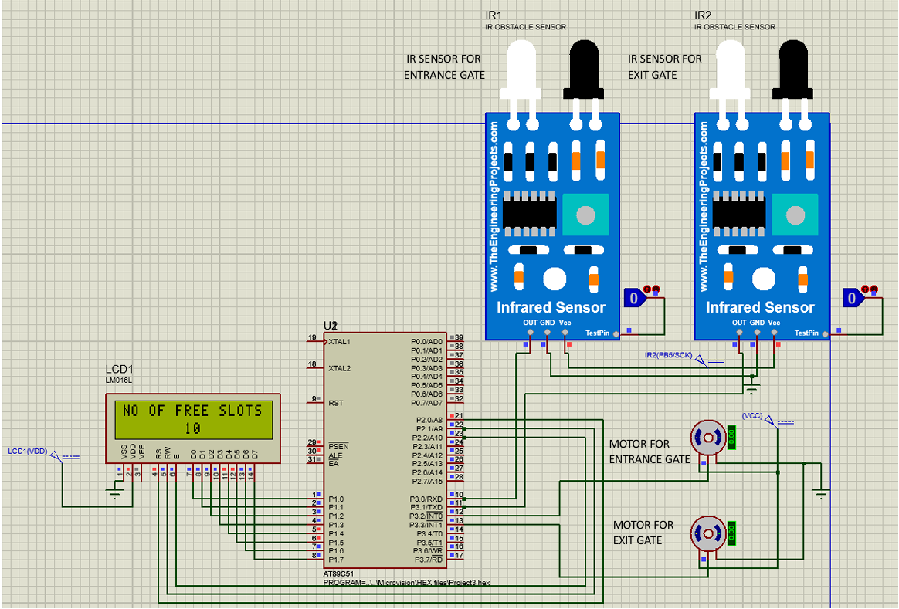
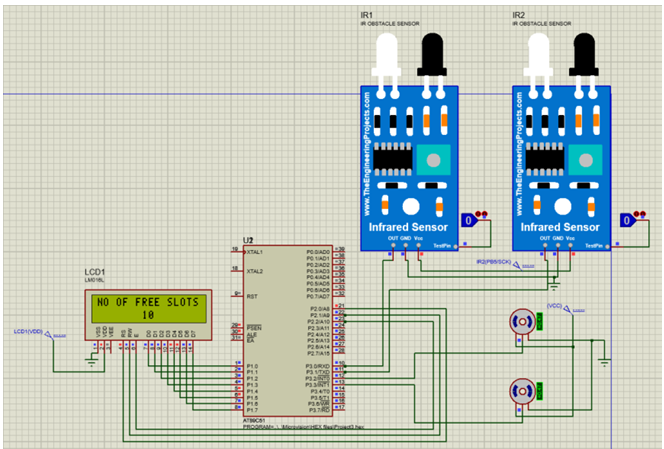
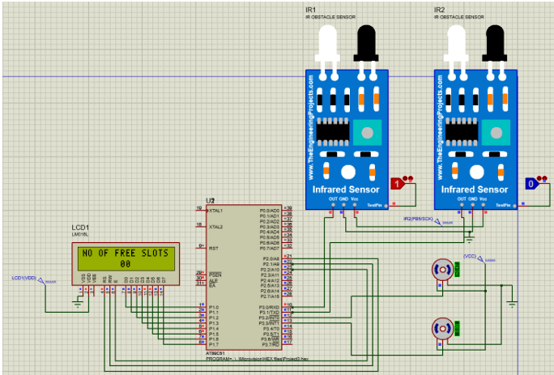
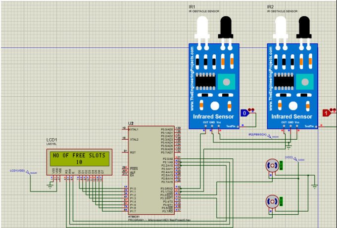

## Proteus Simulation Result

### 1. Initial Stage
- Both IR sensors are LOW.
- Both servo motors (entrance and exit) are closed.
- LCD displays the total slots: `10`.

---

### 2. Car Arrives at Entrance
- IR sensor at the entrance detects the car.
- Servo motor opens the gate (rotates 90°).
- After 5 seconds, gate closes.
- Free slots shown on LCD become `9`.

---

### 3. Car at Exit
- IR sensor at exit detects the car.
- Exit gate opens.
- After 5 seconds, gate closes.
- Free slots increase to `10`.

---

### 4. Gate Does Not Open When Full
- If all slots are full, entrance gate doesn’t open even if the sensor is triggered.

---

### 5. Exit Gate Ignores False Triggers
- Exit gate won’t open if no car is inside, even if the sensor is triggered by mistake.

